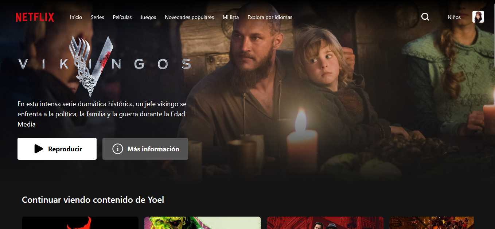

# 🎬 Netflix Clone



<p align="center">
  
  
  
  
</p>

> A **visual and functional clone inspired by Netflix**, built with **Vite + Vue.js + Tailwind CSS**.  
> This project recreates Netflix’s modern interface, featuring a responsive design, reusable components, and a scalable structure focused on learning and frontend development practice.

---

## 🚀 Technologies Used

- ⚡ **[Vite](https://vitejs.dev/)** → fast and modern development environment.  
- 🖼️ **[Vue.js 3](https://vuejs.org/)** → progressive framework for building dynamic interfaces.  
- 🎨 **[Tailwind CSS](https://tailwindcss.com/)** → fast, customizable, and responsive styling.  
- 🔄 **Modular architecture** → clear separation between components, views, and styles.

---

## 🧩 Main Features

✅ Netflix-inspired interface (home, series, movies, etc.)  
✅ **100% responsive** design adaptable to mobile and desktop  
✅ Reusable components (Navbar, Cards, Info Modals)  
✅ Clean folder and code organization with **Vite + Vue 3**  
✅ Modern visual style using **Tailwind CSS**

---

## ⚙️ Installation & Setup

To run the project locally, follow these steps 👇

```bash
# 1️⃣ Clone the repository
git clone https://github.com/YoelLazarte/Netflix.git

# 2️⃣ Navigate to the project directory
cd Netflix

# 3️⃣ Install dependencies
npm install

# 4️⃣ Start the development server
npm run dev
```

---

## 📂 Project Structure
```
├── public            # Static assets (e.g., images)
├── src               # Main source files
│   ├── components    # Reusable components
│       └── modal     # Information modals
│   ├── router        # Router configuration and navigation
│   ├── services      # App services and utilities
│   ├── pages         # Application pages
├── package.json      # Project dependencies and scripts
└── README.md         # Project documentation
```

---

### 👨‍💻 Author

Yoel Lazarte
Full Stack Developer | Passionate about clean and functional interfaces

📧 yoelazarte04@gmail.com

---
## 📝 License

This project is licensed under the MIT License.
You are free to use, modify, and distribute it with proper attribution.